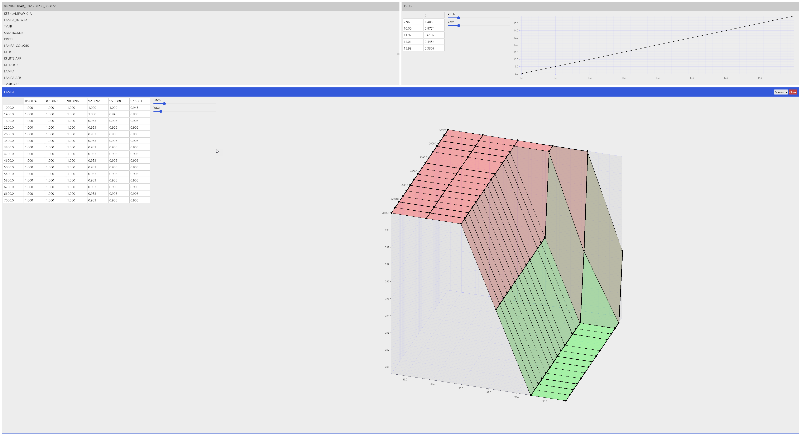

# HEXTuner

Simple tuning software for ECUs written in Rust using [iced-rs](https://iced.rs/) for the GUI.

Designed for use with TunerPro XDF files. Compatibility of all files not guaranteed.
Most testing is being done with the Nefmoto community project: Stage1 1.8t ME7.5 A4 (8E0909518AK-0003) files.
Very rudimentary testing was done with the 2.7t community project files ([8D0907551M-20190711.xdf](https://files.s4wiki.com/defs/8D0907551M-20190711.xdf)).
Also "works" with the TylerW 518AK XDF, flags not supported.

The program has all backend functionality implemented (other than making sure it works with ALL possible XDF files).

A lot of the work was done creating the [xdftuneparser-rs](https://github.com/willemml/xdftuneparser-rs) library.
Mostly because I could not find any good specifications on how the format works which turned it into a reverse engineering exercise.
As such not all data types are supported and not all files can be understood correctly.

Here is a screenshot of the UI. As you can see 3D graphs are somewhat broken.

### Roadmap

Mostly from greatest to lowest priority, not set in stone:
- UI for editing bins **done**
- Graphs to visualize maps
- Live comparison of different bins
- Built in checksumming
- Bootmode and or KWP2000 flashing
- GUI app, non TUI **done**
- Definition editing

### Why?

Given that free software like TunerPro exists you may be wondering why I made this.

Here is a list:
- I couldn't find software that supported Linux/macOS
- Existing software seems to be closed source
- Seemed like a fun project and might help me learn a thing or two about ECUs
  (especially if/when I implement flashing for ME7)
